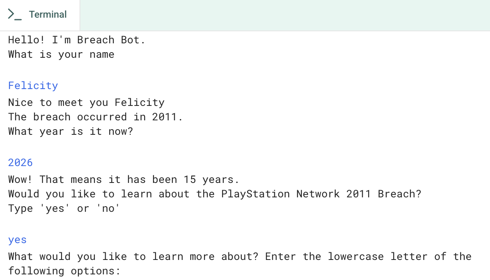

# Breach Bot
## About the Project
Hello everyone! This project is a simple interactive Python chatbot for learning more about the 2011 PlayStation Network date breach amd other related information. Breach Bot explains to you what happened, describes Sony's response, and connects the incident to the CIA triad, which are: confidentiality, integrity, and availability. And also, it even shares some of my personal reflection on this topic!

## Main Features
- Greets the user by name
- Asks for the current year and calculates how long ago the breach occurred
- Uses simple menus so users can choose what to learn about
- Shares my personal reflection and practical sybersecurity advice for users to consider

## Project Screenshot


## Language Used
- Python 3

## How to Run the Project Locally
### Requirements
- Python 3.10 or newer
- No third-party packages are required to run Breach Bot

### Instructions
1. Click the green **Code** button and then select **Download ZIP**.
2. Unzip the downloaded folder.
3. Open a terminal in the project folder.
4. Run the program:
```bash
python main.py

## Link to Run the Code
- [Breach Bot](https://github.com/Felicity520666/Breach-Bot/releases/download/v1.0.0/Breach-Bot-Windows.exe)


## Instructions 
Follow the prompts and enter the letter beside your chosen topic. Enter `c` in the first menu to continue to the reflection section, Enter `d` in the second menu when you are finished.

## Creator
Created by [Felicity](https://github.com/Felicity520666). Friendly feedback and suggestions are always welcome!